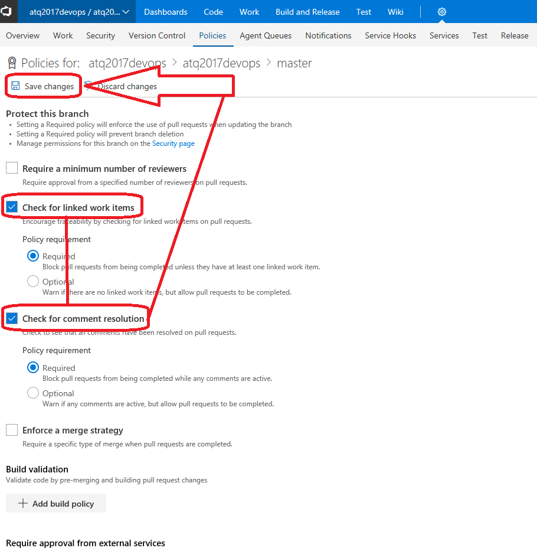

Previous lab: [Introduction](../Introduction/README.md)

# Lab 1 - Source control

Duration: 15 min

The goal of this lab is to setup a Git source control with VSTS by importing an existing GitHub repository having a sample ASP.NET Core web application. 

Best practices highlighted:

- Use Git as decentralized source control
- Configuration of policies regarding branch, commit and pull request
- Automate communications with your teammates through Slack notifications

You will go through 3 main sections in this lab:

- Import existing Git repository
- Setup branch policies
- Setup Slack notification for "Pull Request created"

## Import existing Git repository

0. Open a **new web browser instance in Incognito, Private or InPrivate mode** to avoid any signed-in session conflict.
1. Go to your VSTS account `https://<yourvstsaccount>.visualstudio.com` and open your existing empty project (default: **MyFirstProject**, otherwise create a new one).
2. Navigate to the **Code** tab
3. Use the "Import into an existing empty repository" feature by hitting the **Import** button like illustrated on the image below.

4. Set the fields **Source type** to `Git` and **Clone URL** to `https://github.com/mathieu-benoit/DevOpsOnAzureLab.git` and click on **Import**.

Note: this GitHub repository you are importing contains a sample ASP.NET Core web app with unit tests and selenium tests which will be used during the next labs. Stay tuned!

## Setup branch policies

5. Once the repository imported with the previous step, go to the **Code** tab and navigate to the **Branch policies** feature of the `master` branch like illustrated below:

6. Enable **Protect this branch** and then enable **Check for linked work items** and **Check for comment resolution** as well.

7. Then, click on the **Save changes** toolbar button at the top of this page.

## Setup Slack notification for "Pull Request created"

8. Sign-in with your Slack account for this lab - for example: `https://atq-qc-2017.slack.com`.
9. Go to this new app configuration link: `https://atq-qc-2017.slack.com/apps/new/A0F81FPF0-visual-studio-team-services`, type the `#code` channel and click on the **Add Visual Studio Integration** button.

10. Once the result page is displayed ("New integration added!"),  copy the **WebHook URL** field value `https://hooks.slack.com/services/...` to be used with the next steps. 

11. Click the **Gear** icon and navigate to the **Service Hooks** page of your VSTS project and from there click on the **Create a new subscription** button as illustrated below.

12. On the next pages, select **Pull request created** for the **Trigger on this type of event** option and let the default **Filters**, then click on **Next** to paste the **Slack Webhook URL** value `https://hooks.slack.com/services/...` you copied from the Slack configuration completed earlier. Finally, click on **Finish** to see the new associated Service Hook entry:

(Optional) You could repeat these actions to setup Slack notifications for other actions from VSTS for example: Build completed, Release deployment completed, Work item created, Code pushed, etc. *For the Agile Tour Quebec 2017, these 4 other Slack notifications were already completed for you in the accounts provided*.

You are now all set for this lab. All these concepts will be used and illustrated with the next labs.

Next lab: [Lab 2 - Continuous Integration](../Lab%202%20-%20Continuous%20Integration/README.md)