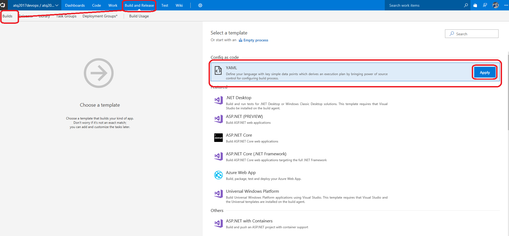
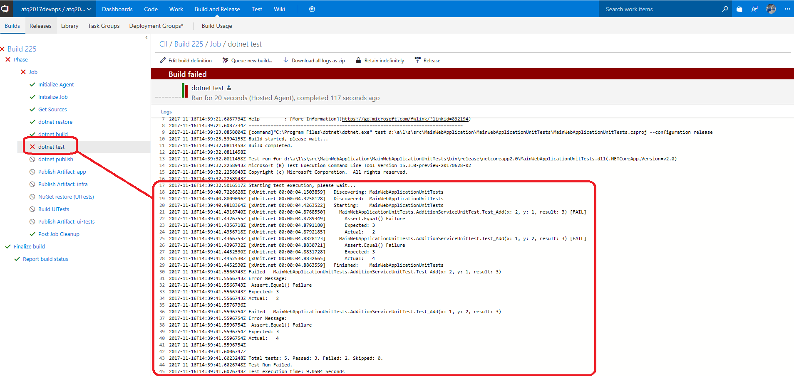
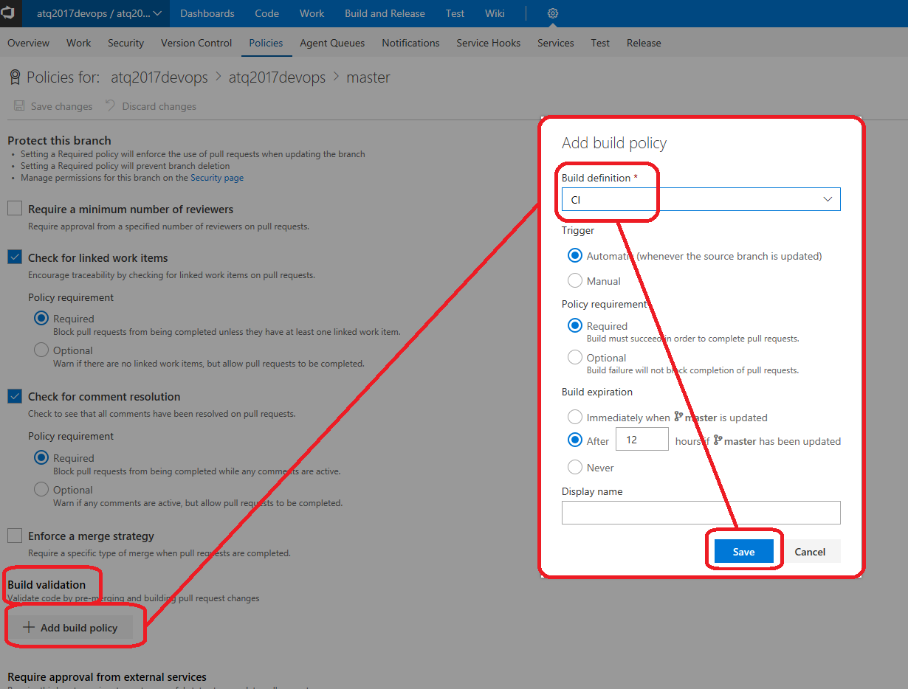
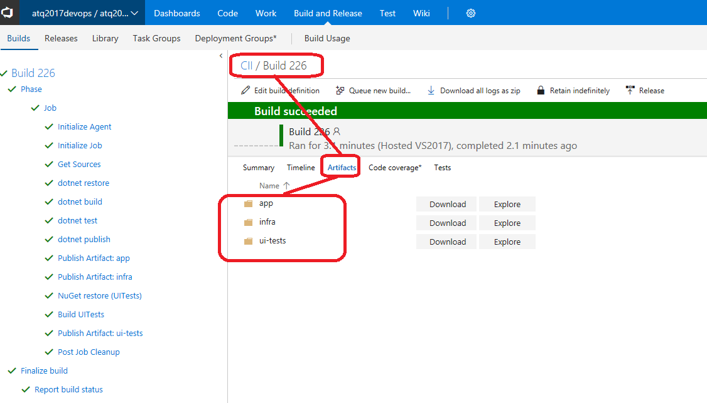

Previous lab: [Lab 1 - Source control](../Lab%201%20-%20Source%20control/README.md)

# Lab 2 - Continuous Integration

Duration: 30 min

The goal of this lab is to configure the different steps of the *Continuous Integration (CI)* process for a given web app through a VSTS Build Definition. The basic concepts of a CI phase is to expose different artifacts which will be used during the next Continuous Delivery (CD) phase. Finally, you will trigger 2 builds to observe the process: One manually initiated and one auto-triggered by a commit. 

Best practices highlighted:

- Import Build Definition and Task Group from files ("as code") provided by the "Ops" team
- Integrate unit tests during the CI process
- Trigger CI at each commit into master branch
- Validate code on feature-branch by pre-merging and building PR changes
- Do code review through PR (comments, rejection, etc.)
- Automatically create work items on build failures as bug in the backlog
- Generate artifacts to be reused in a separate Continuous Delivery (CD) process
- Automate communications with your teammates through Slack notifications

You will go through 4 main sections in this lab:

- Create/Import the VSTS Build definition and expose the "app" artifact
- Update the "master" branch policies to validate code by pre-merging and building PR changes
- Fix the unit test issue by submitting a new pull request
- Import tasks group to expose the "infra" and "ui-tests" artifacts

## Create the VSTS Build definition and expose the "app" artifact

0. Open a **new web browser instance in Incognito, Private or InPrivate mode** to avoid any signed-in session conflict.
1. Go to your VSTS account `https://<yourvstsaccount.visualstudio.com` and open your VSTS project for this lab. *For the Agile Tour Quebec 2017, checkout your sticker.*
2. Navigate to **Build and Release** > **Build** tab and click on the **Import** button on the top right hand corner to import the file below. Copy/paste this path into the **File name** field and then click on **Open** and finally **Import**:

`
https://raw.githubusercontent.com/mathieu-benoit/DevOpsOnAzureLab/master/docs/Lab%202%20-%20Continuous%20Integration/CI-BuildDefinition.json
`

3. Once the Build definition has been imported, you will land on the **Tasks** > **Process** step, change the **Name** field to `CI`:

4. You will observe a `Some settings need attention` error. To resolve, click on the **Get sources**.

5. Navigate to the **Triggers** tab of this Build definition page and enable the **Trigger status** of the **Continuous Integration** section.

6. Navigate to the **Options** tab of this Build definition page and enable the **Create work item on failure** and **Automatically link new work in this build** options.

7. Click on the **Save & queue** toolbar button (top right hand corner). The **Save build definition and queue** will popup and just click on the **Save & queue** button.

8. At this point the build has been started.  After ~2 min this build should failed because of a unit test failure:

*Note: If the notifications triggers in the previous lab were completed successfully, you should be able to see the 2 different notifications related to this failure in Slack: 1 for the Build failed in the `#build` channel and 1 other for the Work Item created in the `#work` channel.*

## Update the "master" branch policies to validate code by pre-merging and building PR changes

9. Now we have a build definition created, let's adjust the `master` branch policies to reinforce quality check while creating and managing new Pull Request on branches; Go to the `master` branch policies page (as you did with the [previous lab](../Lab%201%20-%20Source%20control/README.md)) and click on the **Add build policy** to then select the `CI` Build definition we just created. Click on **Save** on the pop-up:

10. Then, click on the **Save changes** toolbar button at the top of this page.

## Fix the unit test issue by submitting a new pull request

11. Go to the VSTS **Work** main tab to create a new branch based on the `master` branch. Click on **New branch** action and name it as `fix-add-method` and then click on the **Create branch** button:

12. Navigate to the `src/MainWebApplication/MainWebApplication/Services/AdditionService.cs` file on this `fix-add-method` branch. Click on the **Edit** button (top right hand corner) and then update the line 7 by replacing `return y + y;` by `return x + y;` (Yeah, big mistake! ;)). Click on the **Commit...** button (top right hand corner again) and on the **Commit** button on the *Commit* dialog.

13. You will be invited to create a Pull Request based on this commit on this branch. Let's proceed to land on the **New Pull Request** page:

14. As a PR/code review, comment the line updated on the right hand side:

15. On the **Overview** tab of this PR you should see the status of the current policies: 1 Build should be in progress and **Not all comments resolved**. By waiting the end of the current build, let's **Resolve** the comment:

16. Once the Build is completed successfully (now that you have resolved the unit test issue in this PR, the build should pass), you will be able to **Complete** this PR. A new build will be triggered after the merge into master, it should be completed successfully. Furthermore, you should see new Slack notifications (Code pushed + Build completed).

## Import tasks group to expose the "infra" and "ui-tests" artifacts

17. Navigate to the **Build and Release** > **Task Groups** tab and click on the **Import** button on the top left hand corner to import the file below. Copy/paste this path into the **File name** field and then click on **Open** and finally **Import**:

`
https://raw.githubusercontent.com/mathieu-benoit/DevOpsOnAzureLab/master/docs/Lab%202%20-%20Continuous%20Integration/ExposeInfraAndUITestsArtifacts-TaskGroupDefinition.json
`

18. Once imported, just rename this Task Group as `ExposeInfraAndUITestsArtifacts` and you should see the 4 tasks pre-configured:

19. Go to the **Build and Release** > **Build** tab, and open your **CI** Build definition as illustrated below:

 

20. Add an instance of the Tasks Group just imported. Once added, let's rename this step as `Expose "infra" and "ui-tests" Artifacts`:

21. **Save and Queue** this build. Once it will be successfully completed you should see the 3 artifacts below and should see the Slack notifications as well:

You are now all set for this lab. Let's see how the 3 artifacts of these CI will be used with the next lab during the CD process.

Next lab: [Lab 3 - Continuous Delivery](../Lab%203%20-%20Continuous%20Delivery/README.md)